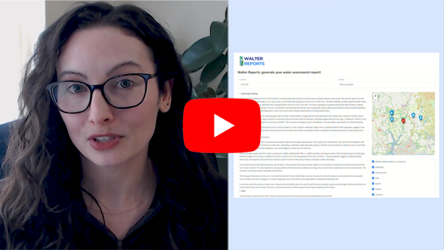
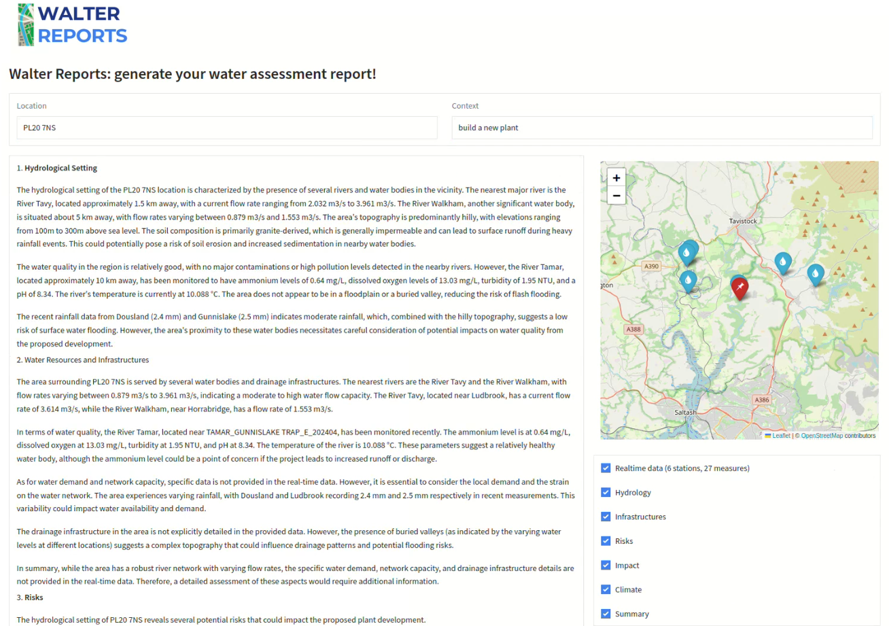
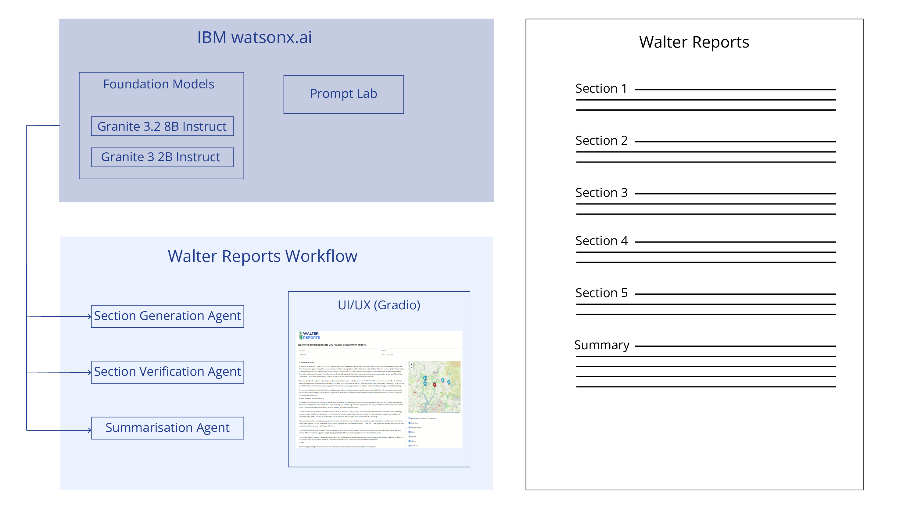

## Project summary

The UK’s population has surged by 13 million since the 1960s, causing water consumption to double, with over 5 billion additional litres used daily. In London, the sewer system—originally built for 4 million people—now serves nearly 9 million, relying heavily on storm overflows releasing rainwater and diluted sewage, which pollutes clean water resources. This outdated approach significantly impacts water quality.
The 2024 revised draft Water Resources Management Plans (WRMPs) forecasts that, without decisive action, England’s public water supply could face a shortfall of 4860 million litres per day by 2050. Contributing factors include population growth, climate change, environmental protection measures and demands from new developments.

Walter Reports is an innovative agentic AI solution that produces detailed water assessment reports for new-build projects, including council housing, farms, industrial sites and more. By integrating data APIs from the UK Environment Agency (https://environment.data.gov.uk), Walter Reports provides real-time insights into key factors such as:

- Water quality
- Rainfall patterns
- Water flow
- Aquifer pollution
- Flood risks
- Topography

In addition, Walter Reports evaluates climate change impacts and the potential effects of new developments on the local water networks. Reports are tailored to specific UK postcodes and project descriptions, supporting informed decision-making for local councils, companies planning a new plant, factory or site, or anyone looking to exploit the land.

How Walter Reports works:

- User enters a valid UK postcode and project description.
- Data Retrieval: Our autonomous agent gathers information from nearby water stations using external tools and APIs such as the UK Environment Agency.
- Visualisation: A map highlights the project location and adjacent water stations with up-to-date data.
- Report Generation: a report is generated section by section by an agent. A verification agent validates or rejects the content of the section. In the latter case, an alternative section is generated instead. Finally, a summarisation agent concludes the report with highlights of the key elements of the report.
- After the report is generated, users can download it, start a new report, or explore findings further by interacting with Walter’s AI chat agent. Example questions are provided to guide deeper analysis and kickstart the conversation.

Powered by the IBM watsonx.ai platform and relying on an agentic workflow, Walter Reports leverages Granite 3 2B and 3.2 8B foundation models in combination with Prompt Lab capabilities. Walter Reports features multiple agents using different models, prompts and sampling parameters to enhance the accuracy and reliability of the report. For increased transparency and alignment with AI safety principles, Walter Reports highlights its data sources, specifies the number of data points analysed for each location, displays them on a map, and shows the current step of the report generation process.

[](https://youtu.be/nNqcwoRvrjU)

## Repository

Our repository includes the following files:

```bash
├── assets/
│   ├── walter-architecture.png
│   ├── walter-logo.png
│   ├── walter-screenshot.png
│   └── walter-thumbnail.png
│
├── LICENSE
├── README.md
├── main.py
└── requirements.txt
```

## Prerequisites

- Clone our GitHub repository and go to the main directory.

- Create a virtual environment and install Python dependencies:

```bash
python3 -m venv venv
source venv/bin/activate
pip install -r requirements.txt
```

## Run Walter Reports

- Start Walter Reports with your WATSONX_AI_URL, WATSONX_AI_PROJECT_ID and WATSONX_AI_API_KEY:

```bash
python3 main.py --watsonx_ai_url <WATSONX_AI_URL> --watsonx_ai_project_id <WATSONX_AI_PROJECT_ID> --watsonx_ai_api_key WATSONX_AI_API_KEY
```

This will display the following:

```bash
Authenticating to IBM watsonx.ai...
* Running on local URL:  http://127.0.0.1:7860

To create a public link, set `share=True` in `launch()`.
```

- Open the local URL in your web-browser to start using Walter Reports.

## Screenshot



## Architecture

Our solution is an agent-based workflow written in Python using watsonx.ai as inference engine. Each agent is defined by a Granite LLM, a custom prompt and sampling parameters created with and stored in Prompt Lab.

Our workflow uses 3 main agents to generate a full report and is able to query an external tool (water data API from the UK Environment Agency, see API Portal https://environment.data.gov.uk/apiportal):

- *Section Generation Agent*, which writes one section at a time, guided by the information provided by the user (location, context) and the water data retrieved via the UK Environment Agency API.
- *Section Verification Agent*, which verifies a given section. If validation fails, a new section is generated by the Section Generation Agent to replace the invalid section.
- *Summarisation Agent*, which generates highlights once the rest of the report is generated.

Additionally, once the report is generated, users can use the *Chat Agent* to interact with the report.



## The Team

- Amandine Flachs

- Alexandre Borghi

## License

Walter Reports has an Apache 2.0 license, as found in the [LICENSE](LICENSE) file.
